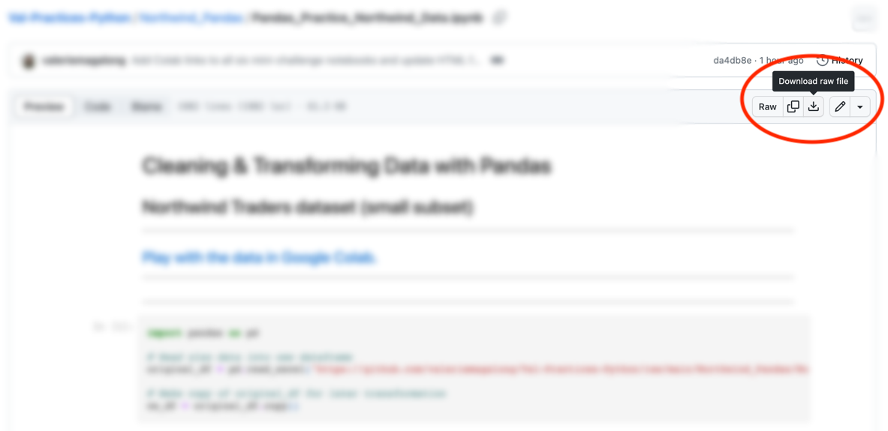

# 👩🏻‍💻 I practice Python!

## A collection of Jupyter notebooks showcasing my journey in learning Python for data analytics.

This repository was created and continually updated while I was learning Python fundamentals at Fullstack Academy DATA (in partnership with NYC Tech Talent Pipeline).  I aimed to gain mastery over the following data analysis and visualization modules:  

* NumPy
* Pandas
* Matplotlib
* Seaborn

The mini-challenges detailed below document my journey in learning these essential tools.

<table style="text-align:center">
    <tr>
        <th>At A Glance</th>
        <th>Repo Link 🔗 / Colab Link </th>
        <th>What I Practiced / Used</th>
    </tr>
    <tr>
        <td><a href="https://htmlpreview.github.io/?https://github.com/valeriemagalong/Val-Practices-Python/blob/main/Monty_Hall_Problem/monty_hall_problem.html">Monty Hall Problem</a></td>
        <td><a href="https://github.com/valeriemagalong/Val-Practices-Python/tree/main/Monty_Hall_Problem">🔗 </a></td>
        <td>NumPy random module, conditional statements, probability calculations</td>
    </tr>
    <tr>
        <td><a href="https://htmlpreview.github.io/?https://github.com/valeriemagalong/Val-Practices-Python/blob/main/Employee_MLB_Pandas/Pandas_Practice_Employee_MLB_Data.html">Manipulating Employee & MLB Data</a></td>
        <td><a href="https://github.com/valeriemagalong/Val-Practices-Python/tree/main/Employee_MLB_Pandas">🔗 </a></td>
        <td>Pandas: Series, DataFrames, data import/export methods, descriptive methods</td>
    </tr>
    <tr>
        <td><a href="https://htmlpreview.github.io/?https://github.com/valeriemagalong/Val-Practices-Python/blob/main/Northwind_Pandas/Pandas_Practice_Northwind_Data.html">Cleaning & Transforming Northwind Data</a></td>
        <td><a href="https://github.com/valeriemagalong/Val-Practices-Python/tree/main/Northwind_Pandas">🔗 </a></td>
        <td>Pandas: DataFrame indexing, transformation methods, aggregation methods</td>
    </tr>
    <tr>
        <td><a href="https://htmlpreview.github.io/?https://github.com/valeriemagalong/Val-Practices-Python/blob/main/Countries_Iris_Matplotlib/Matplotlib_Practice_Countries_Iris_Data.html">Visualizing World Countries Data & Iris Flower Data</a></td>
        <td><a href="https://github.com/valeriemagalong/Val-Practices-Python/tree/main/Countries_Iris_Matplotlib">🔗 </a></td>
        <td>Matplotlib: histograms, scatter plots, bar plots</td>
    </tr>
    <tr>
        <td><a href="https://htmlpreview.github.io/?https://github.com/valeriemagalong/Val-Practices-Python/blob/main/Penguins_Seaborn/Seaborn_Practice_Penguins_Data.html">Visualizing Penguins Data</a></td>
        <td><a href="https://github.com/valeriemagalong/Val-Practices-Python/tree/main/Penguins_Seaborn">🔗 </a></td>
        <td>Seaborn: categorical plots, pairwise correlation plots (heatmaps, pairplots)</td>
    </tr> 
    <tr>
        <td><a href="https://htmlpreview.github.io/?https://github.com/valeriemagalong/Val-Practices-Python/blob/main/Penguins_Statistics/Statistics_Practice_Penguins_Data.html">Exploring Statistics with Penguins Data</a></td>
        <td><a href="https://github.com/valeriemagalong/Val-Practices-Python/tree/main/Penguins_Statistics">🔗 </a></td>
        <td>Pandas: descriptive statistics (median, min/max, percentiles), Seaborn: visualizing distribution (KDE plot)</td>
    </tr> 
</table>

---
## Viewing a Jupyter notebook in your browser  

If you only want to view a Jupyter notebook without making any changes, simply click on the link in the *At A Glance* column in the table above.  This will take you to a static page displaying the notebook's contents.

If you would like to interact with the notebook cells and modify the code, you can open the notebook in Google Colab by either:
1. Clicking on the  icon in the *Repo Link / Colab Link* column in the table above.
2. Clicking on the **Play with the data in Google Colab.** link at the top of the Jupyter notebook.

You must be logged into a Google Account in order to interact with the notebook in Google Colab.  Since the notebook is loaded directly from GitHub, any executions or changes made during your Colab session will not be saved.  If you want to save your own copy to Google Drive in order to make modifications, click on the  button located near the top of the Colab page.

---
## Saving a Jupyter notebook to your local machine  

To run a Jupyter notebook locally in your IDE of choice, NumPy, Pandas, Matplotlib, and/or Seaborn must be installed in your local environment or virtual environment.  (The specific libraries used, if any, are always imported at the beginning of each notebook.)  Official installation instructions for each library are included below:
* [NumPy Installation](https://numpy.org/install/)
* [Pandas Installation](https://pandas.pydata.org/docs/getting_started/install.html)
* [Matplotlib Installation](https://matplotlib.org/stable/users/installing/index.html)
* [Seaborn Installation](https://seaborn.pydata.org/installing.html)

The raw .ipynb file can be saved to your local machine by navigating to the repository sub-folder (also accessible via the 🔗 icon in the table above), clicking on the .ipynb file, and clicking on the *Download raw file* icon (circled in red below).

